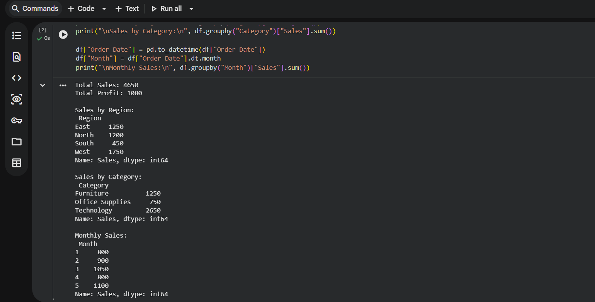

# 🐍 Python Sales Data Analysis

## 🎯 Objective  
Analyze sales data using Python to extract insights.

---

## 🛠 Tools Used  
- Python  
- Pandas  

---

## 📊 Analysis Performed  
- Total Sales & Profit  
- Sales by Region  
- Sales by Category  
- Monthly Sales Trend  

---

## 📸 Output  

---

## 🚀 Conclusion  
This project demonstrates data analysis using Python and Pandas.
